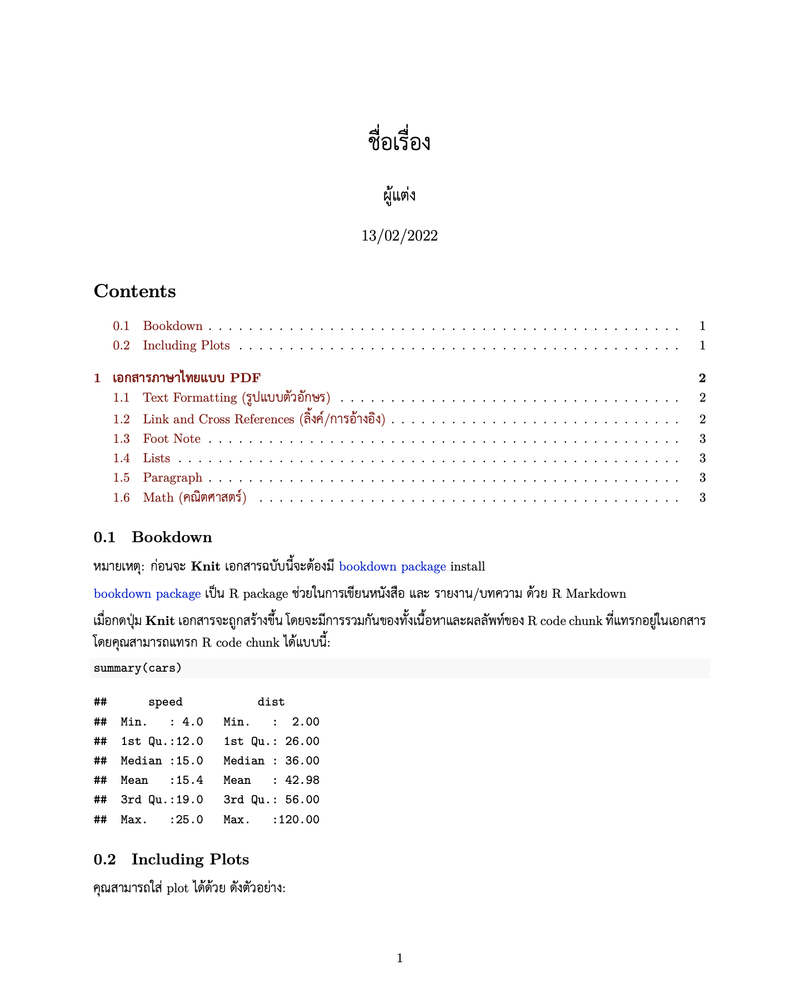
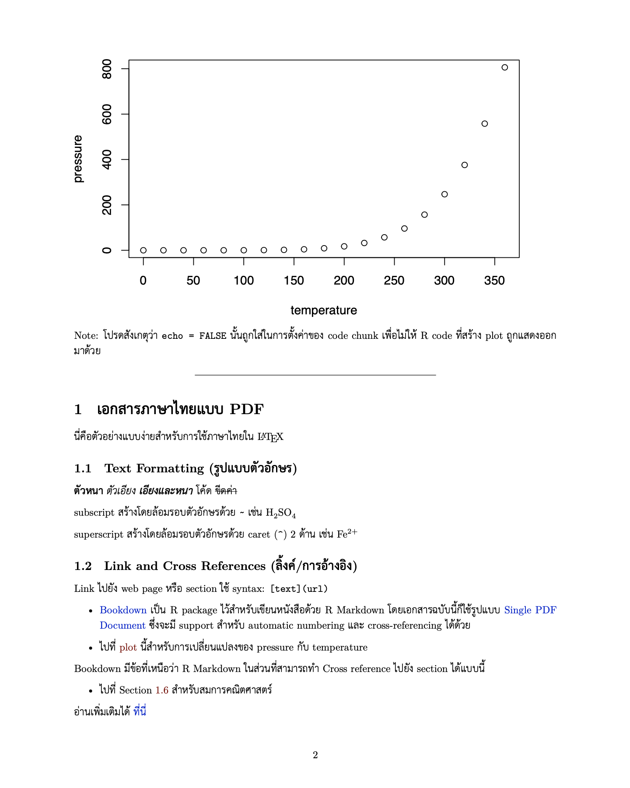
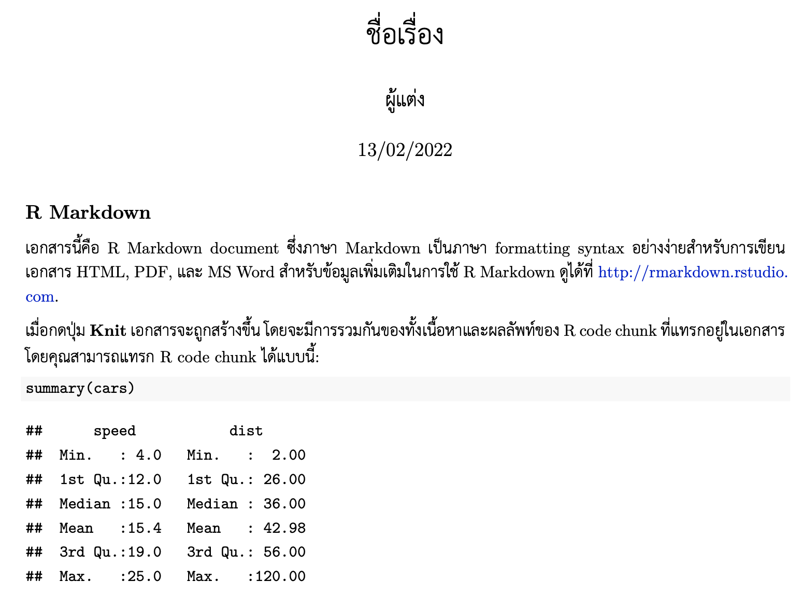

<!-- README.md is generated from README.Rmd. Please edit that file -->

```{r, include = FALSE}
# from: https://github.com/mitchelloharawild/vitae/blob/master/README.Rmd
knitr::opts_chunk$set(
  collapse = TRUE,
  comment = "#>",
  fig.path = "man/figures/README-",
  out.width = "100%"
)
```

# thaipdf

<!-- badges: start -->

[](https://lifecycle.r-lib.org/articles/stages.html#experimental)

<!-- badges: end -->

> R package :package: ช่วยสร้าง PDF document จาก R Markdown ที่ใช้ **ภาษาไทย**

```{r show-previews, echo=FALSE, results='asis'}
knitr::kable(
  tibble::tibble(
    `1` = "",
    `2` = ""
    ),
  escape = FALSE
)
```

### Contents

-   [เกริ่นนำ (Introduction)](#Introduction)

-   [วิธีการติดตั้ง (Installation)](#Installation)

-   [วิธีการใช้งาน (Usage)](#Usage)

# Introduction

### Goal

จุดมุ่งหมายของ R package นี้ **เพื่อให้ท่านสามารถสร้าง PDF เป็นภาษาไทยจาก R Markdown ได้โดยง่าย**

### Problem

ถ้าท่านได้ลองพิมพ์ภาษาไทยใน R Markdown แล้ว knit เป็น pdf_document จะพบว่าเกิด error ขึ้น

    Error: LaTeX failed to compile something.tex.

การสร้าง PDF จาก R Markdown นั้น จะผ่านกระบวนการที่แปลงเอกสารหลายขั้นตอน ซึ่ง **ภาษาไทย** จะมีปัญหาที่ขั้นตอน

> **LaTeX -> PDF**

วิธีแก้นั้น จะต้องมีการตั้งค่าต่างๆ ใน LaTeX preamble และ YAML header ของ R Markdown เพื่อให้รองรับกับการใช้งานภาษาไทยได้ โดย R package นี้จึงถูกสร้างขึ้นเพื่อ**ช่วยให้ง่ายขึ้น**ใน workflow จุดนี้

(อ้างอิงจาก: [คําแนะนําการตั้งค่า LATEX สําหรับใช้ภาษาไทย](http://pioneer.netserv.chula.ac.th/~wdittaya/LaTeX/LaTeXThai.pdf))

# Installation

การ install เหล่านี้ทำเพียงครั้งเดียวเท่านั้น

-   **Install thaipdf:** ติดตั้ง development version ของ thaipdf จาก [GitHub](https://github.com/Lightbridge-KS/thaipdf) ด้วย:

``` r
# install.packages("remotes")
remotes::install_github("Lightbridge-KS/thaipdf")
```

-   **Install XeLaTeX และ LaTeX package** ที่จำเป็นสำหรับการใช้ภาษาไทย อาจทำได้อย่างง่ายโดยใช้ [{tinytex}](https://yihui.org/tinytex/) R package:

``` r
install.packages("tinytex")

# For using R Markdown
tinytex::install_tinytex() 

# Install LaTeX PKG required by `thaipdf`
tinytex::tlmgr_install(c(
  "fontspec", "ucharclasses", "setspace", "polyglossia",
  "hyperref", "url", "cite", "xcolor"
))
```

โดย LaTeX package ที่จำเป็นสำหรับ type setting ภาษาไทยคือ "fontspec", "ucharclasses", "setspace" และ "polyglossia" (ส่วน "hyperref", "url", "cite" และ "xcolor" นี้ให้ install ไป เพราะ thaipdf จะมีการใช้ใน preamble ด้วย)

-   **Check font:** ตรวจสอบว่าในเครื่องมีฟอนท์ [TH Sarabun New](https://www.f0nt.com/release/th-sarabun-new/) ถ้าไม่มีให้ติดตั้งด้วย (เนื่องจาก thaipdf ใช้ font นี้เป็นตัวหลัก)

# Usage

## Option 1: From R Markdown Template {#rmd-template}

วิธีใช้ที่ง่ายที่สุด คือสร้าง R Markdown ที่รองรับภาษาไทยจาก template ที่ package นี้มีให้

ถ้าท่านใช้ RStudio ให้ไปที่ `File -> New File -> R Markdown... -> From Template`


เลือก template อย่างใดอย่างหนึ่ง

-   **Thai R Markdown PDF** — ใช้ [`pdf_document()`](https://pkgs.rstudio.com/rmarkdown/reference/pdf_document.html) สร้าง output หรือ

-   **Thai Bookdown PDF** — ใช้ [`bookdown::pdf_document2()`](https://pkgs.rstudio.com/bookdown/reference/html_document2.html) สร้าง output ซึ่งจะสร้างสารบัญได้ และทำ cross-referencing ได้ดีกว่า

จากนั้นใส่ชื่อไฟล์และตำแหน่งที่ให้สร้างที่ช่อง **Name** กับ **Location** แล้วคลิก **OK**

จะมีการสร้าง folder ใน structure แบบนี้ (`<NAME>` คือชื่อที่กรอกในช่อง Name ไป)

    <NAME>/
     |
     |--> <NAME>.Rmd
     |
     |--> preTeX/
           |
           |--> thai-preamble.tex

(ใน folder จะมี R Markdown file ที่มี YAML header ที่ตั้งค่าต่างๆ ไว้ให้แล้ว โดยใช้ LaTeX preamble จาก `preTeX/thai-preamble.tex` แทรกเข้ามาด้วย)

สุดท้ายให้ไปที่ R Markdown ไฟล์ จากนั้นกดปุ่ม **Knit** (cmd/ctr + shift + K) ได้เลย จะได้เอกสารเป็น PDF ภาษาไทยที่มี เนื้อหา โค้ด และ กราฟอย่างสวยงาม



(ภาพตัวอย่างจาก Thai R Markdown PDF)

## Option 2: Create LaTeX preamble for Thai Language {#latex-preamble}

ทางเลือกนี้สำหรับผู้ที่มีไฟล์ R Markdown อยู่แล้ว แต่ต้องการปรับให้ใช้กับภาษาไทยได้ โดยหลักการคือจะต้องใช้ LaTeX engine เป็น xelatex และใช้ LaTeX preamble ที่มี package และคำสั่งต่างๆ สำหรับ type setting ภาษาไทย

ฟังก์ชั่น **`thaipdf::use_thai_preamble()`** จะทำการ

-   **สร้างไฟล์ LaTeX preamble** ชื่อว่า `thai-preamble.tex` (default) โดยจะมีการเรียกใช้ LaTeX package และคำสั่งต่างๆ ในการตั้งค่าภาษาไทยในไฟล์นี้ การตั้งค่า font ภาษาไทยหลักจะเป็น "TH Sarabun New" แต่สามารถเปลี่ยนได้ที่ argument `thai_font`

จากนั้นให้ **ปรับ [YAML header](https://bookdown.org/yihui/rmarkdown-cookbook/rmarkdown-anatomy.html)** ของ R Markdown ในส่วนของ [`pdf_document:`](https://pkgs.rstudio.com/rmarkdown/reference/pdf_document.html) หรือ [`bookdown::pdf_document2:`](https://pkgs.rstudio.com/bookdown/reference/html_document2.html) ดังนี้

-   ตั้ง `latex_engine: xelatex`

-   ใส่ path ให้ `thai-preamble.tex` ถูก includes ไปที่ `in_header:`

### Example

```{r use_thai_preamble}
thaipdf::use_thai_preamble()
```

**จากนั้นปรับ YAML header ใน R Markdown** (`pdf_document`)

``` yaml
output:
  pdf_document:
    latex_engine: xelatex  # จำเป็นต้องใช้ xelatex สำหรับภาษาไทย
    includes:
      in_header: "preTeX/thai-preamble.tex" # path ไปยัง preamble ที่มีปรับให้ใช้ภาษาไทยได้
```

```{r unlink, include=FALSE}
unlink("thai-preamble.tex")
```

------------------------------------------------------------------------

Last Updated: `r Sys.Date()`
