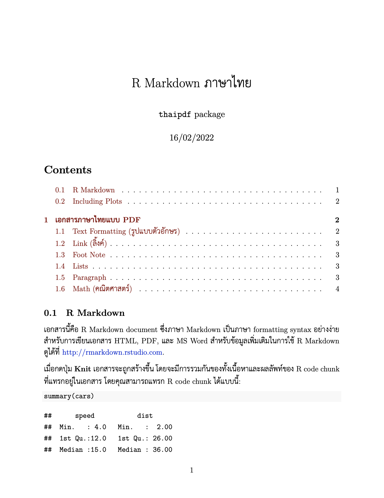
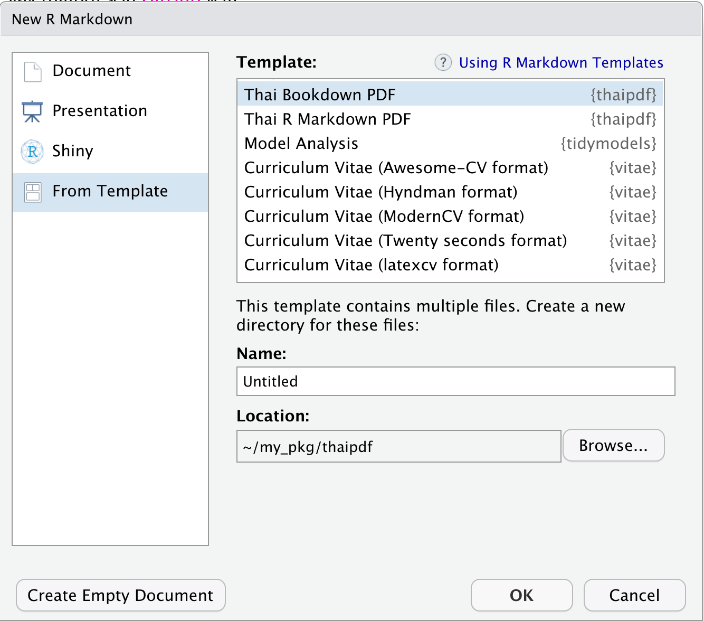
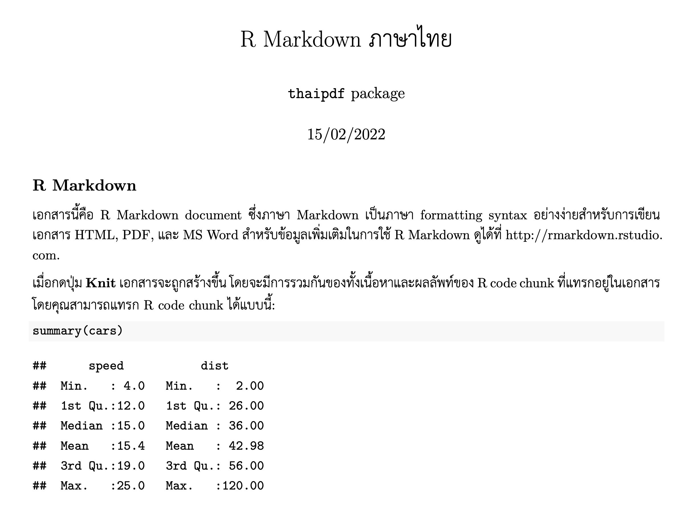

<!-- README.md is generated from README.Rmd. Please edit that file -->

# thaipdf <a href="https://lightbridge-ks.github.io/thaipdf/"></a>

<!-- badges: start -->

[](https://lifecycle.r-lib.org/articles/stages.html#experimental)
[](https://github.com/Lightbridge-KS/thaipdf/actions)
[](https://codecov.io/gh/Lightbridge-KS/thaipdf)

<!-- badges: end -->

> R package :package: ช่วยสร้าง PDF document จาก R Markdown ที่ใช้
> **ภาษาไทย :thailand:**

| 1                                                   | 2                                                   |
|:----------------------------------------------------|:----------------------------------------------------|
|  |  |

# Goal

R package นี้ช่วย**สร้าง PDF เป็นภาษาไทย :thailand: จาก [R
Markdown](https://rmarkdown.rstudio.com) ได้โดยง่าย**

-   **ผู้เริ่มต้น** สามารถ **knit** เอกสาร R Markdown เป็น PDF
    ได้ทันทีโดยใช้ template ที่มีให้ และ

-   **ผู้ที่ใช้งาน [LaTeX](https://www.latex-project.org) เป็น**
    สามารถเรียกใช้ LaTeX preamble ที่มีการตั้งค่าภาษาไทยมาให้แล้ว มา
    customize เพิ่มเติมอย่างที่ต้องการได้

โดยจะพยามคง option ต่างๆ ของ R Markdown ไว้ให้ได้มากที่สุด
ซึ่งสามารถส่งต่อ YAML parameter ไปยัง R Markdown หรือ bookdown ได้ด้วย

# Install

**Install thaipdf:** ติดตั้ง development version ของ thaipdf จาก
[GitHub](https://github.com/Lightbridge-KS/thaipdf) ด้วย:

``` r
# install.packages("remotes")
remotes::install_github("Lightbridge-KS/thaipdf")
```

**Install XeLaTeX และ LaTeX package** ที่จำเป็นสำหรับการใช้ภาษาไทย
อาจทำได้อย่างง่ายโดยใช้ [{tinytex}](https://yihui.org/tinytex/) R
package:

``` r
install.packages("tinytex")

# For using R Markdown
tinytex::install_tinytex() 

# Install LaTeX PKG required by `thaipdf`
tinytex::tlmgr_install(c(
  "fontspec", "ucharclasses", "polyglossia"
))
```

**Check font:** ตรวจสอบว่าในเครื่องมีฟอนท์ [TH Sarabun
New](https://www.f0nt.com/release/th-sarabun-new/)
ถ้าไม่มีให้ติดตั้งด้วย (เนื่องจาก thaipdf ใช้ font นี้เป็นตัวหลัก)

# Usage

วิธีใช้ที่ง่ายที่สุด คือสร้าง R Markdown ที่รองรับภาษาไทยจาก template
ที่ package นี้มีให้

ถ้าท่านใช้ RStudio ให้ไปที่
`File -> New File -> R Markdown... -> From Template`



เลือก template **Thai PDF R Markdown** หรือ **Thai PDF Bookdown**
จากเมนู

กดปุ่ม **`OK`** จะเปิดไฟล์ R Markdown template ที่รองรับกับภาษาไทย


จากนั้นกดปุ่ม **`Knit`** (cmd/ctr + shift + K) ได้เลย จะได้เอกสารเป็น
PDF ภาษาไทยที่มี เนื้อหา โค้ด และ กราฟ อยู่รวมกัน



# Learn more

-   [**Get Started with
    thaipdf**](https://lightbridge-ks.github.io/thaipdf/articles/thaipdf.html)

------------------------------------------------------------------------

Last Updated: 2022-03-21
