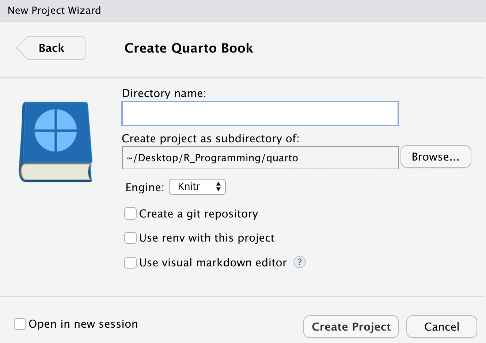

```{r, include = FALSE}
knitr::opts_chunk$set(
  collapse = TRUE,
  comment = "#>"
)
```

## Intro to Quarto

[**Quarto**](https://quarto.org) เป็น scientific markdown publishing system สร้างโดยทีมงานที่สร้าง R Markdown มีจุดมุ่งหมายเป็น super-set หรือ next-generation ของ R Markdown โดย Quarto สามารถ

-   รองรับภาษา R, Python, Julia, Observable JS

-   รองรับ R Markdown (`.Rmd`), Jupyter notebook (`.ipynb`), และ Quarto markdown (`.qmd`)

-   สามารถ render output ได้หลายรูปแบบ เช่น HTML, PDF, MS Word, etc. หรือแม้แต่ใช้เขียน หนังสือ, website, blog

-   รองรับสำหรับ scientific markdown สำหรับเอกสารทางวิชาการได้ดี ไม่ว่าจะเป็น equations, citation, crossrefs, callouts, หรือ layout ต่างๆ

## Quarto to PDF in Thai

เอกสาร Quarto ที่มีภาษาไทย สามารถ render เป็น HTML, MS Word ได้ทันที แต่สำหรับ **PDF จะต้องมีการ setup เพิ่มเติม** ซึ่งจะอธิบายวิธีการในบทความนี้

> **โดยสรุป:** หลักการคือ **แทรก LaTeX preamble ที่มีการตั้งค่าภาษาไทย** เข้าไป ก่อนที่ LaTeX จะ compile เป็น PDF นั่นเอง

(สำหรับ PDF engine ทาง Quarto ใช้เป็น XeLaTeX เป็น default ซึ่งรองรับภาษาไทยได้อยู่แล้่ว)

## Example

ในตัวอย่างนี้จะสอนการสร้าง [Quarto Book](https://quarto.org/docs/books/) ที่มีภาษาไทย โดย render เป็น PDF

ผมได้สร้าง repository ตัวอย่างไว้ที่นี่: 

> [**Example Thai Quarto Book Repository**](https://github.com/Lightbridge-KS/quarto-book-thai-pdf) 

ซึ่งเป็นรูปแบบ Quarto Book โดยสามารถดูผลลัพท์ที่ render แล้วได้จาก:

-   [**PDF Book in Thai**](https://github.com/Lightbridge-KS/quarto-book-thai-pdf/blob/main/docs/Quarto-Book-ไทย.pdf) (and [LaTeX output](https://github.com/Lightbridge-KS/quarto-book-thai-pdf/blob/main/Quarto-Book-ไทย.tex))

-   [**HTML Book**](https://lightbridge-ks.github.io/quarto-book-thai-pdf/)

## Tutorial

### Step 1: Create Quarto Book

สร้าง [Quarto book Project](https://quarto.org/docs/books/) หรือถ้าใช้ RStudio สามารถสร้างโดย

> `New Project` -\> `Quarto Book`

{alt="Create Quarto Book" width="600"}


### Step 2: Get Thai LaTeX Preamble Setting


สร้าง LaTeX preamble ที่มีการตั้งค่าภาษาไทย ไว้ใน project โดยใช้คำสั่ง

```r
thaipdf::use_thai_preamble()
```

จะสร้างไฟล์ [`thai-preamble.tex`](https://github.com/Lightbridge-KS/quarto-book-thai-pdf/blob/main/thai-preamble.tex) ที่ตั้งค่า font เป็น "TH Sarabun New" มาให้ (สามารถเปลี่ยนเป็น font อื่นได้ที่ `thai_font` argument)


### Step 3: Include Thai Preamble


จากนั้น ในไฟล์ที่มีตั้งค่าสำหรับ Quarto (`_quarto.yml` หรือ `_metadata.yml`) ให้ใส่ `thai-preamble.tex` ไปที่ [`include-in-header`](https://quarto.org/docs/output-formats/pdf-basics.html#latex-includes) ของ `pdf` แบบนี้

[**`_quarto.yml`**](https://github.com/Lightbridge-KS/quarto-book-thai-pdf/blob/main/_quarto.yml)

```yml
format:
  pdf:
    include-in-header: "thai-preamble.tex"
```

(สามารถเก็บ intermediate LaTeX ไว้เพื่อ debug ได้ด้วย `keep-tex: true`)

จากนั้นสามารถใช้ภาษาไทยและ render เป็น PDF ได้เลย 

```sh
quarto render
```

จากตัวอย่างจะได้ผลลัพท์ PDF เป็น [**PDF Book in Thai**](https://github.com/Lightbridge-KS/quarto-book-thai-pdf/blob/main/docs/Quarto-Book-ไทย.pdf)

จบแล้วครับ เย่! 🎉
