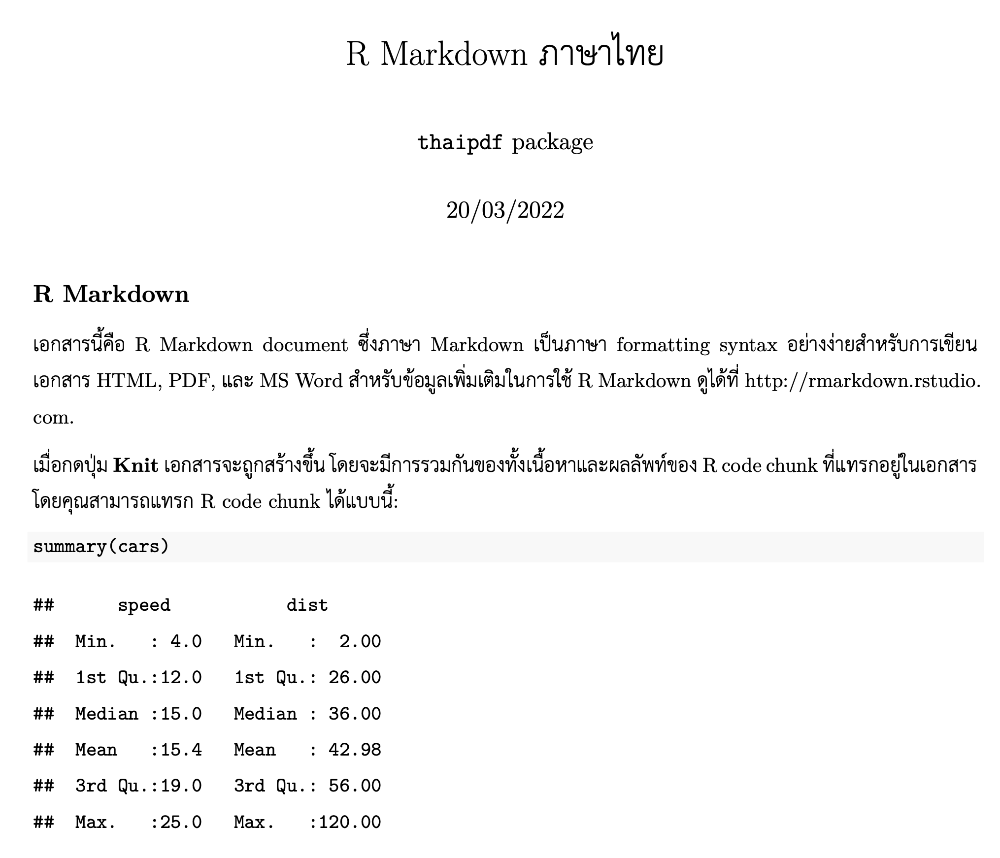
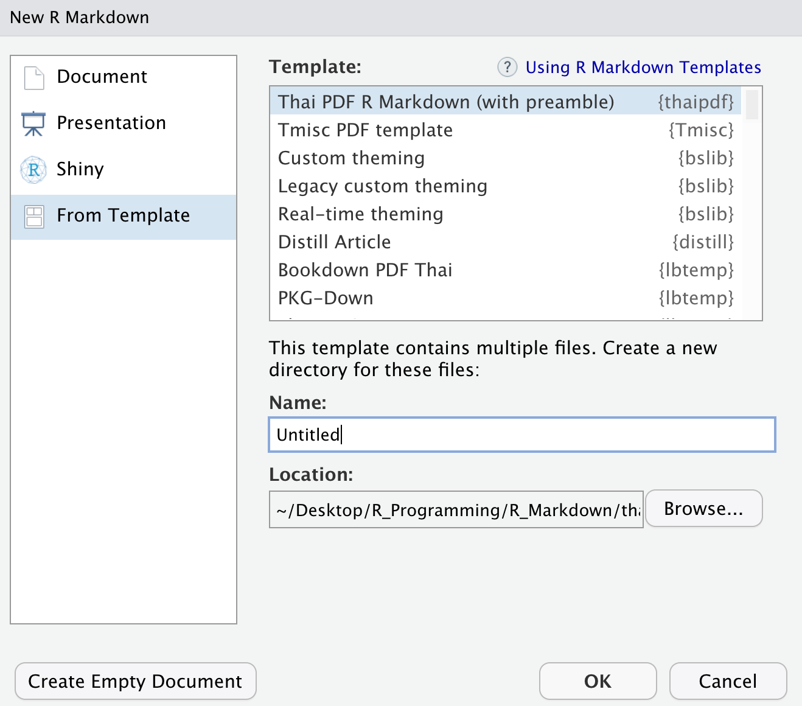

```{r, include = FALSE}
knitr::opts_chunk$set(
  collapse = TRUE,
  comment = "#>"
)
```

## Introduction

ถ้าได้ลองพิมพ์ภาษาไทยใน R Markdown แล้ว knit เป็น `pdf_document` จะพบว่าเกิด error ขึ้น

    Error: LaTeX failed to compile something.tex.

การสร้าง PDF จาก R Markdown นั้น จะผ่านกระบวนการที่แปลงเอกสารหลายขั้นตอน ซึ่ง **ภาษาไทย** จะมีปัญหาที่ขั้นตอน

> **LaTeX -\> PDF**

วิธีแก้นั้น จะต้องมีการตั้งค่าต่างๆ ใน LaTeX preamble และ YAML header ของ R Markdown เพื่อให้รองรับกับการใช้งานภาษาไทยได้ โดย **R package นี้จึงถูกสร้างขึ้นเพื่อช่วยใน workflow จุดนี้**

(อ้างอิงจาก: [คําแนะนําการตั้งค่า LATEX สําหรับใช้ภาษาไทย](http://pioneer.netserv.chula.ac.th/~wdittaya/LaTeX/LaTeXThai.pdf))

## Installation

การ install เหล่านี้ทำเพียงครั้งเดียวเท่านั้น

-   **Install thaipdf:** ติดตั้ง development version ของ thaipdf จาก [GitHub](https://github.com/Lightbridge-KS/thaipdf) ด้วย:

``` r
# install.packages("remotes")
remotes::install_github("Lightbridge-KS/thaipdf")
```

-   **Install XeLaTeX และ LaTeX package** ที่จำเป็นสำหรับการใช้ภาษาไทย อาจทำได้อย่างง่ายโดยใช้ [{tinytex}](https://yihui.org/tinytex/) R package:

``` r
install.packages("tinytex")

# For using R Markdown
tinytex::install_tinytex() 

# Install LaTeX PKG required by `thaipdf`
tinytex::tlmgr_install(c(
  "fontspec", "ucharclasses", "polyglossia"
))
```

โดย LaTeX package ที่จำเป็นสำหรับ type setting ภาษาไทยคือ "fontspec", "ucharclasses" และ "polyglossia"

-   **Check font:** ตรวจสอบว่าในเครื่องมีฟอนท์ [TH Sarabun New](https://www.f0nt.com/release/th-sarabun-new/) ถ้าไม่มีให้ติดตั้งด้วย (เนื่องจาก thaipdf ใช้ font นี้เป็นตัวหลัก)

# Basic Usage

## Stand-alone R Markdown Template

วิธีใช้ที่ง่ายที่สุด คือสร้าง R Markdown ที่รองรับภาษาไทยจาก template ที่ package นี้มีให้

ถ้าท่านใช้ RStudio ให้ไปที่ `File -> New File -> R Markdown... -> From Template`

{alt="New R Markdown Template" width="600"}

เลือก template **Thai PDF R Markdown** หรือ **Thai PDF Bookdown** จากเมนู

กดปุ่ม **`OK`** จะเปิดไฟล์ R Markdown template ที่รองรับกับภาษาไทย

{alt="thaipdf R Markdown in RStudio" width="600"}

จากนั้นกดปุ่ม **`Knit`** (cmd/ctr + shift + K) ได้เลย จะได้เอกสารเป็น PDF ภาษาไทยที่มี เนื้อหา โค้ด และ กราฟ อยู่รวมกัน

{width="600"}

โปรดสังเกตุว่าการที่ภาษาไทยใช้งานได้นั้น เนื่องจากมีการตั้งค่า YAML header ในส่วน

``` yaml
output: 
  thaipdf::thaipdf_document:
```

โดยที่ template ของ thaipdf ทั้ง 2 แบบ

-   **Thai PDF R Markdown** --- ใช้ output เป็น `thaipdf_document()` ซึ่งเป็น wrapper ของ [`pdf_document()`](https://pkgs.rstudio.com/rmarkdown/reference/pdf_document.html) ที่สามารถรองรับ**ภาษาไทย**ได้ สำหรับการใช้งานอย่างง่าย หรือ

-   **Thai PDF Bookdown** --- ใช้ output เป็น `thaipdf_book()` ซึ่งเป็น wrapper ของ [`bookdown::pdf_book()`](https://pkgs.rstudio.com/bookdown/reference/pdf_book.html) ที่สามารถรองรับ**ภาษาไทย**ได้ และมี feature ของ bookdown ที่เหมาะสำหรับการเขียนเอกสารทางวิชาการหรืองานตีพิมพ์ที่ต้องการทำ cross references หรือ citation จากแหล่งต่างๆ

## Customization

### Thai Font & Line Spacing

สำหรับ `thaipdf_document()` และ `thaipdf_book()` จะมี argument ที่สร้างไว้ให้รองรับ **การตั้งค่าสำหรับภาษาไทย** ดังนี้

-   **`thai_font`:** สำหรับตั้งค่า font family ภาษาไทย โดย default เป็น "TH Sarabun New" ซึ่งสามารถเปลี่ยนเป็น font ใดก็ได้ที่ลงไว้ในเครื่อง

-   **`line_spacing`:** สำหรับระยะห่างระหว่างบรรทัด โดย default ตั้งอยู่ที่ 1.5 เท่า สาเหตุที่เลือกให้ห่างขึ้นมา เพื่อเว้นที่ให้กับสระ และ วรรณยุกต์ ที่อยู่บน/ล่างตัวอักษรภาษาไทย

``` yaml
output: 
  thaipdf::thaipdf_document:
    thai_font: "TH Sarabun New"
    line_spacing: 1.5
```

### R Markdown / Bookdown Arguments

เนื่องจากทั้ง 2 function ของ thaipdf นี้ (`thaipdf_document()`, `thaipdf_book()`) สามารถ "**ส่งต่อ argument"** ไปยัง [`rmarkdown::pdf_document()`](https://pkgs.rstudio.com/rmarkdown/reference/pdf_document.html) หรือ [`bookdown::pdf_book()`](https://pkgs.rstudio.com/bookdown/reference/pdf_book.html) ได้

ดังนั้นเราจึงสามารถ ใส่ argument อื่นๆ ที่รองรับโดย 2 function ดังกล่าวได้เลย (ยกเว้น `latex_engine` กับ `includes`) เช่น

``` yaml
---
title: "R Markdown ภาษาไทย"
author: "`thaipdf` package"
output: 
  thaipdf::thaipdf_book:
    thai_font: "TH Sarabun New"
    line_spacing: 1.5
    toc: true # table of content
    keep_tex: false # "true" to keep intermediate LaTeX
---
```

สังเกตุว่าต้อง **indent 4 space** ด้วย เพราะจากตัวอย่างเป็น argument ที่ส่งเข้า `thaipdf_book()`

-   `toc: true` คือกำหนดให้มีสารบัญ

-   `keep_tex: true` คือเก็บไฟล์ LaTeX ไว้ด้วย ก่อนที่ pandoc จะ compile เป็น PDF

สำหรับ argument ตัวอื่นๆ ที่ใช้ได้ ของ [`rmarkdown::pdf_document()`](https://pkgs.rstudio.com/rmarkdown/reference/pdf_document.html) ยังมีอีกมาก ลองอ่านได้ที่:

-   [PDF document --- R Markdown: The Definitive Guide](https://bookdown.org/yihui/rmarkdown/pdf-document.html#other-features)

### Pandoc Variables

เนื่องจาก R Markdown ใช้ pandoc เป็นตัวแปลง LaTeX เป็น PDF ดังนั้นจึงสามารถใส่ [pandoc variable](https://pandoc.org/MANUAL.html#variables-for-latex) ใน YAML header ได้โดยตรง ซึ่งจะมีประโยชน์ในการปรับ setting อื่นๆ เช่น ปรับขนาด font, เปลี่ยน font family ภาษาอังกฤษ, ทำให้ link หรือ citation มีสีสัน เช่น

``` yaml
---
title: "R Markdown ภาษาไทย"
author: "`thaipdf` package"
output: 
  thaipdf::thaipdf_document:
    thai_font: "TH Sarabun New"
fontsize: 12pt
mainfont: "TeX Gyre Termes"
monofont: "Fira Code iScript"
# Color provided by LaTeX "xcolor" package
linkcolor: BrickRed 
urlcolor: NavyBlue
---
```

**Font size ---** จากตัวอย่าง ปรับขนาด font ด้วย `fontsize`

**Font family ---** จากตัวอย่าง มี font family ทั้ง 3 ชนิดในเอกสารคือ

-   `thai_font`: คือ font **ภาษาไทย**

-   `mainfont`: คือ font หลัก **ภาษาอังกฤษ**

-   `monofont`: คือ font ของ `code`

**Color** --- จากตัวอย่าง ปรับสีของ link ในเอกสาร และ URL ได้ด้วย `linkcolor` และ `urlcolor` ตามลำดับ

นอกจากนี้ยังมี pandoc variable อื่นๆ อีกมาก ลองอ่านได้ที่ [Pandoc variable for LaTeX](https://pandoc.org/MANUAL.html#variables-for-latex)

------------------------------------------------------------------------

# Advance Usage

## R Markdown Template with LaTeX preamble {#rmd-pre}

สำหรับผู้ที่ใช้ LaTeX เป็น และต้องการ customize หลายสิ่งกับ LaTeX ให้ลองเลือก template ที่ชื่อว่า `Thai PDF R Markdown (with preamble)`

{alt="New R Markdown Template with Preamble" width="600"}

จากนั้นใส่ชื่อไฟล์และตำแหน่งที่ให้สร้างที่ช่อง **Name** กับ **Location** แล้วคลิก **OK**

จะมีการสร้าง folder ใน structure แบบนี้ (`<NAME>` คือชื่อที่กรอกในช่อง Name ไป)

    <NAME>/
     |
     |--> <NAME>.Rmd
     |
     |--> pre-tex/
           |
           |--> thai-preamble.tex

ใน folder จะมี R Markdown file ที่มี YAML header ที่ตั้งค่าที่สำคัญคือ:

``` yaml
output:
  pdf_document:
    latex_engine: xelatex  # จำเป็นต้องใช้ xelatex สำหรับภาษาไทย
    includes:
      in_header: "pre-tex/thai-preamble.tex" # path ไปยัง preamble ที่มีปรับให้ใช้ภาษาไทยได้
```

-   **`latex_engine`** เป็น "xelatex" เพื่อให้ใช้ภาษาไทยได้

-   **`includes`** คือการนำไฟล์ LaTeX preamble ที่ตั้งค่าให้ใช้ภาษาไทยได้ (`thai-preamble.tex`) มาแทรกใน preamble header (`in_header`) ของ output LaTeX อีกที ก่อนที่จะ compile เป็น PDF

ดังนั้นเราจึงสามารถเขียน LaTeX เพิ่มเติม หรือ load package และตั้งค่าอื่นๆ ในไฟล์ `thai-preamble.tex` ได้อีกด้วย เช่นทำ link ให้มีสี (เหมือนภาพแรกสุดที่แสดง)

## Use LaTeX preamble {#latex-preamble}

จะเป็นการสร้างไฟล์ `thai-preamble.tex` ที่เป็น LaTeX preamble สำหรับภาษาไทย ขึ้นมาใน working directory (สามารถเปลี่ยนได้) และมีคำแนะนำการตั้งค่าใน YAML ของ R Markdown ให้ด้วย

ทางเลือกนี้เหมาะสำหรับ

1.  ผู้ที่มีไฟล์ R Markdown อยู่แล้ว แต่ต้องการปรับให้ใช้กับภาษาไทยได้
2.  ผู้ที่ใช้ LaTeX เป็น สามารถดึงตัว LaTeX preamble ภาษาไทยมาใช้ และ customize เพิ่มเติมตามที่ต้องการได้เลย

ฟังก์ชั่น **`thaipdf::use_thai_preamble()`** ถูกออกแบบในทำนอง [usethis package](https://usethis.r-lib.org) โดยจะทำการ

-   **สร้างไฟล์ LaTeX preamble** ชื่อว่า `thai-preamble.tex` (default) โดยจะมีการเรียกใช้ LaTeX package และคำสั่งต่างๆ ในการตั้งค่าภาษาไทยในไฟล์นี้ เช่น ฟอนท์ภาษาไทย (`thai_font`) หรือ ระยะห่างระหว่างบรรทัด (`line_spacing`)

จากนั้นให้ **ปรับ [YAML header](https://bookdown.org/yihui/rmarkdown-cookbook/rmarkdown-anatomy.html)** ของ R Markdown ในส่วนของ [`pdf_document:`](https://pkgs.rstudio.com/rmarkdown/reference/pdf_document.html) หรือ [`bookdown::pdf_document2:`](https://pkgs.rstudio.com/bookdown/reference/html_document2.html) ซึ่งต้องทำเอง ดังนี้

-   ตั้ง `latex_engine: xelatex`

-   ใส่ path ให้ `thai-preamble.tex` ถูก includes ไปที่ `in_header:`

-   ใส่คำสั่ง `\sloppy` เพื่อตัดคำภาษาไทย ไปที่ R Markdown ส่วนต้น (หลังจาก YAML header)

## Example

```{r use_thai_preamble}
.old_wd <- setwd(tempdir()) # for example only

thaipdf::use_thai_preamble()

setwd(.old_wd) # for example only
```

**ใน R Markdown** (`pdf_document`) ให้ปรับ **YAML header** และใส่คำสั่ง `\sloppy`

``` markdown
---
title: "ทดสอบภาษาไทย" 
output:
  pdf_document:
    latex_engine: xelatex  # จำเป็นต้องใช้ xelatex สำหรับภาษาไทย
    includes:
      in_header: thai-preamble.tex # path ไปยัง preamble ที่มีปรับให้ใช้ภาษาไทยได้
---

\sloppy

# สวัสดีชาวโลก

นี่คือเอกสาร R Markdown **ภาษาไทย** ที่สร้าง PDF ด้วย \LaTeX
```

เสร็จแล้วสามารถกด **`knit`** ได้เลย

{width="600"}

# References

-   [คําแนะนําการตั้งค่า LaTeX สําหรับใช้ภาษาไทย (ฑิตยา หวานวารี)](http://pioneer.netserv.chula.ac.th/~wdittaya/LaTeX/LaTeXThai.pdf)
-   [How to add LaTeX code to the preamble](https://bookdown.org/yihui/rmarkdown-cookbook/latex-preamble.html)
-   [polygloTeX template by mathmd](https://github.com/mathmd/polygloTeX/blob/master/polyglot_template.tex)

------------------------------------------------------------------------

Last Updated: `r Sys.Date()`
